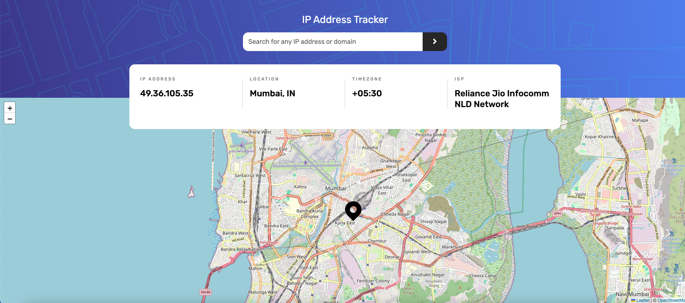
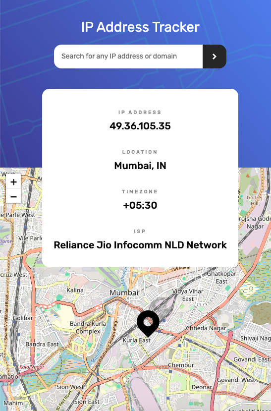

# Frontend Mentor - IP Address Tracker solution

This is a solution to the [IP Address Tracker challenge on Frontend Mentor](https://www.frontendmentor.io/challenges/ip-address-tracker-I8-0yYAH0).

## Table of contents

- [Overview](#overview)
  - [The challenge](#the-challenge)
  - [Screenshot](#screenshot)
  - [Links](#links)
- [My process](#my-process)
  - [Built with](#built-with)
  - [What I learned](#what-i-learned)
  - [Continued development](#continued-development)
  - [Useful resources](#useful-resources)
- [Author](#author)

## Overview

### The challenge

Users should be able to:

- See their own IP Address on the map on the initial page load
- Search for any IP addresses or domains and see the key information and location
- View the optimal layout for each page depending on their device's screen size
- See hover states for all interactive elements on the page

### Screenshot

### Links

- Live Site URL: [https://track-this-ip.netlify.app/](https://track-this-ip.netlify.app/)

## My process

### Built with

- Semantic HTML5 markup
- CSS custom properties
- Flexbox
- CSS Grid
- [React](https://reactjs.org/) - JS library
- [React Leaflet] (https://react-leaflet.js.org/)
- Leaflet (https://leafletjs.com/) - map API
- Ipify - (https://geo.ipify.org/) - IP Geolocation API

### What I learned

This was my first experience using a map API, Leaflet was a great tool to achieve that. It was easier to implement it using React Leaflet components.

## Author

- GitHub - [@poko91](https://github.com/poko91)
- Frontend Mentor - [@poko91] (https://www.frontendmentor.io/profile/poko91)
