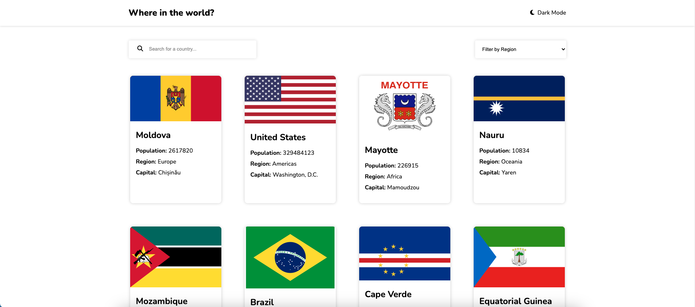
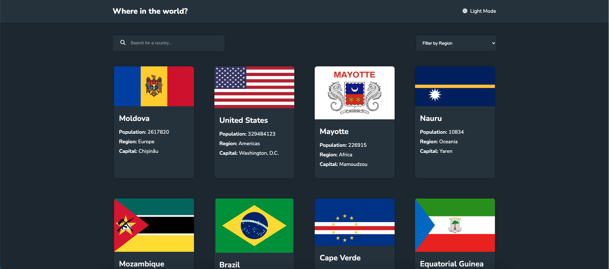
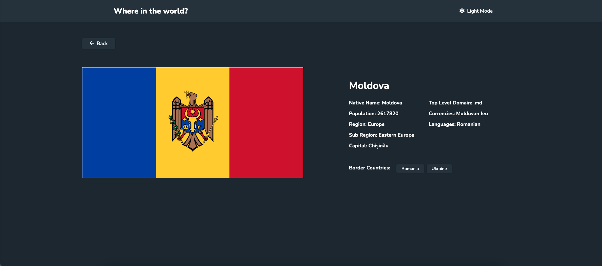

# Frontend Mentor - REST Countries API with color theme switcher solution

This is a solution to the [REST Countries API with color theme switcher challenge on Frontend Mentor](https://www.frontendmentor.io/challenges/rest-countries-api-with-color-theme-switcher-5cacc469fec04111f7b848ca). Frontend Mentor challenges help you improve your coding skills by building realistic projects.

## Table of contents

- [Overview](#overview)
  - [The challenge](#the-challenge)
  - [Screenshot](#screenshot)
  - [Links](#links)
- [My process](#my-process)
  - [Built with](#built-with)
  - [What I learned](#what-i-learned)
  - [Continued development](#continued-development)
  - [Useful resources](#useful-resources)
- [Author](#author)

## Overview

### The challenge

Users should be able to:

- See all countries from the API on the homepage
- Search for a country using an `input` field
- Filter countries by region
- Click on a country to see more detailed information on a separate page
- Click through to the border countries on the detail page
- Toggle the color scheme between light and dark mode _(optional)_

### Screenshot





### Links

- Live Site URL: [https://whereintheworld-countries.netlify.app/](https://whereintheworld-countries.netlify.app/)

## My process

### Built with

- Semantic HTML5 markup
- CSS custom properties
- Flexbox
- [React](https://reactjs.org/) - JS library

### What I learned

The part that took me the longest time to figure out was fetching the border countries using the api - https://restcountries.com/v3.1/alpha/{code}. The response has borders in their codes (eg: IND for India).
In order to show the full names for border-countries, I had to fetch those countries separately, and update my state. I used a separate function updateCountryData() to update the state after fetching the border countries data. I made use of Promise.all to fetch data for each border country together and setTimeout ensures that the state is updated only when all the promises are fulfilled.

```js
const updateCountryData = (country) => {
  setCountryData({
    name: country.name.common,
    flag: country.flags.svg,
    nativeName: Object.values(country.name.nativeName || {})[0]?.common,
    population: country.population,
    region: country.region,
    subRegion: country.subregion,
    capital: country.capital,
    topLevelDomain: country.tld[0],
    currencies: Object.values(country.currencies || {})
      .map((currency) => currency.name)
      .join(", "),
    languages: Object.values(country.languages || {}).join(", "),
    borders: [],
  });

  if (!country.borders) {
    country.borders = [];
  }

  Promise.all(
    country.borders.map((border) => {
      return fetch(`https://restcountries.com/v3.1/alpha/${border}`)
        .then((res) => res.json())
        .then(([borderCountry]) => borderCountry.name.common);
    })
  ).then((borders) => {
    setTimeout(() => setCountryData((prevState) => ({ ...prevState, borders })));
  });
};
```

### Continued development

I'd like to improve my code by using custom hooks or filtering the countries and fetching data.

### Useful resources

#### 📙 API Documentation:

- [REST COUNTRIES API Documentation](https://restcountries.com/#api-endpoints-v2)

#### MDN Documentation

- [Promise.all] (https://developer.mozilla.org/en-US/docs/Web/JavaScript/Reference/Global_Objects/Promise/all)

## Author

- GitHub - [@poko91](https://github.com/poko91)
- Frontend Mentor - [@poko91] (https://www.frontendmentor.io/profile/poko91)
